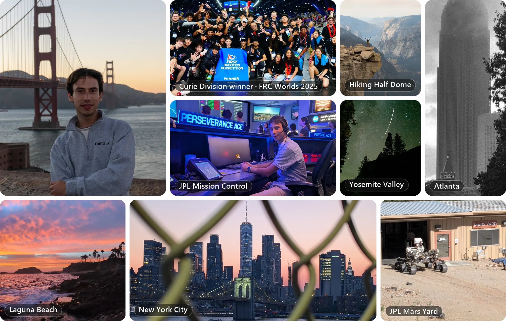

# Joseph Farkas

**Robotics software engineer working on motion planning, state estimation, and spacecraft ground systems** 
Computer Science BS/MS at Georgia Tech · Vice Lead, GNC at Propulsive Landers

Robotics software intern at **NASA JPL** through November 2026

## About

Hiya, my name is Joseph. I'm a CS student at Georgia Tech who loves robots, rocket science, and solving big problems. I'm in the combined bachelor's/master's program, concentrating in embedded systems and AI, with minors in robotics and German. I love seeing my work come to life, and I'm grateful for the opportunities I've had over my early career, including working with Mars rovers at JPL, rocket landers at Propulsive Landers, and competition robots with FIRST Robotics. This fall, I'm living in Pasadena, completing an internship at JPL after wrapping up a summer at Ramp in New York. When I'm not writing code, I'm usually out hiking, taking pictures of skylines or sunsets, or discovering a new city.

## Experience

<table>
<tr>
<td width="76" align="center"></td>
<td valign="top">
<b><a href="https://www.jpl.nasa.gov/">NASA Jet Propulsion Laboratory</a></b> 
<i>Software Engineering Intern, Robotics</i> 
Integrating drive and arm motion planning so Perseverance can drive and use its arm in the same sol (a Martian day). On the ground software side, adding YAMCS support and Grafana dashboards to <a href="https://github.com/nasa/hermes">Hermes</a>.
</td>
<td align="right" valign="top">
Aug&nbsp;&#8288;–&#8288;&nbsp;Nov&nbsp;2026 
<i>Pasadena,&nbsp;CA</i>
</td>
</tr>
<tr>
<td width="76" align="center"></td>
<td valign="top">
<b><a href="https://ramp.com/">Ramp</a></b> 
<i>Backend Software Engineering Intern, Procure-to-Pay Automation</i> 
Built an LLM pipeline that turns user feedback into edits to the classification policy once the evidence for a change crosses a threshold. The updated policy goes back into the prompt, which cut misclassifications from 30% to 5%.
</td>
<td align="right" valign="top">
May&nbsp;&#8288;–&#8288;&nbsp;Aug&nbsp;2026 
<i>New&nbsp;York,&nbsp;NY</i>
</td>
</tr>
<tr>
<td width="76" align="center"></td>
<td valign="top">
<b><a href="https://github.com/ESPL-GT">Engineering Space Policy Lab</a></b> 
<i>Research Assistant</i> 
Modeling downrange risk for space launches to guide launch safety policy, using a dataset of launch attempts scraped from FAA NOTAMs (airspace notices) and plotting the risk contours in QGIS.
</td>
<td align="right" valign="top">
Jan&nbsp;2026&nbsp;&#8288;–&#8288;&nbsp;present 
<i>Atlanta,&nbsp;GA</i>
</td>
</tr>
<tr>
<td width="76" align="center"></td>
<td valign="top">
<b><a href="https://www.viasat.com/">Viasat</a></b> 
<i>Software Engineering Intern</i> 
Multithreaded satellite ephemeris loading and sped up its XML search, which made loading 90% more responsive. Also wrote unit and regression tests for the team's signal-processing algorithms and added them to CI.
</td>
<td align="right" valign="top">
Aug&nbsp;2024&nbsp;&#8288;–&#8288;&nbsp;May&nbsp;2025 
<i>Duluth,&nbsp;GA</i>
</td>
</tr>
</table>

## Teams

<table>
<tr>
<td width="76" align="center"></td>
<td valign="top">
<b><a href="https://gtpropulsivelanders.org/">Propulsive Landers @ Georgia Tech</a></b> 
<i>Vice Lead, Guidance, Navigation, and Controls</i> 
Writing Kalman filters and nonlinear model predictive control in Rust for 6-DOF flight of the team's rocket lander and UAV prototypes.
</td>
<td align="right" valign="top">
Aug&nbsp;2025&nbsp;&#8288;–&#8288;&nbsp;present 
<i>Atlanta,&nbsp;GA</i>
</td>
</tr>
<tr>
<td width="76" align="center"></td>
<td valign="top">
<b><a href="https://github.com/TEAM1771">North Gwinnett Robotics (FRC 1771)</a></b> 
<i>Software Mentor, formerly Autonomous Systems Lead</i> 
Mentoring 70+ high school students in C++ controls and SOLIDWORKS design for a 115 lb competition robot. The robot scores on its own using computer vision localization and on-the-fly A* pathfinding, and its autonomous routines ranked first in the world in 2024. The team also won its division at the 2025 world championship.
</td>
<td align="right" valign="top">
Oct&nbsp;2021&nbsp;&#8288;–&#8288;&nbsp;present 
<i>Suwanee,&nbsp;GA</i>
</td>
</tr>
<tr>
<td width="76" align="center"></td>
<td valign="top">
<b><a href="https://github.com/RoboJackets/robocup-software">RoboJackets RoboCup</a></b> 
<i>Autonomous Software Team</i> 
Wrote C++ path planning, obstacle avoidance, and task allocation for a team of six soccer robots. Also improved the ROS stack that ties the team's software to telemetry, vision, and low-level control.
</td>
<td align="right" valign="top">
Aug&nbsp;2025&nbsp;&#8288;–&#8288;&nbsp;May&nbsp;2026 
<i>Atlanta,&nbsp;GA</i>
</td>
</tr>
</table>

## Projects

<table>
<tr>
<td width="50%" valign="top">
<h3>🛰️ YAMCS support for Hermes</h3>
YAMCS telemetry in Hermes over gRPC, <b>merged into <a href="https://github.com/nasa/hermes">nasa/hermes</a></b>.  
Hermes is NASA's open-source framework for commanding spacecraft and processing their telemetry. YAMCS is an open-source mission control server. The merged plugin serves the YAMCS API to Hermes over gRPC, and follow-up PRs in review record the telemetry in TimescaleDB, chart it in Grafana, and show it live in the Hermes VS Code extension.  
<a href="https://github.com/nasa/hermes">Code</a> · <a href="https://github.com/nasa/hermes/pulls?q=is%3Apr+author%3AFarkasJoseph">PRs</a>
</td>
<td width="50%" valign="top">
<h3>🚀 Optimal Powered Descent</h3>
Group research with <a href="https://gtpropulsivelanders.org/">Propulsive Landers</a>, presented at the <b>AIAA Region II Student Conference</b> in March 2026.  
A rocket lander that replans in flight has to solve for its trajectory quickly, so it solves on a coarse grid. The study compares zero-order-hold discretization with Chebyshev pseudospectral methods on 3-DOF landing problems to see which stays closer to the optimal trajectory at coarse resolutions.  
<a href="https://github.com/GTPL-Testing/MonopropUAV/tree/main/Algorithms/LosslessConvexification/lossless_compare">Code</a> (Rust)
</td>
</tr>
<tr>
<td width="50%" valign="top">
<h3>🎯 Holonomic Auto-Alignment</h3>
<b>Under 1 cm</b> of error lining up to any scoring position, from any starting point.  
Fuses camera pose estimates from ArUco markers with filtered odometry in a real-time state-space model, so FRC 1771's robot can drive itself into scoring position. Written in C++ and Java.
</td>
<td width="50%" valign="top">
<h3>📚 TEAM 1771 Bootcamp</h3>
Every project runs in <b>WPILib simulation</b>, so new members can learn without a robot.  
A self-paced course for new FRC 1771 members on C++ and WPILib, the standard FRC robot library. It goes from setup and C++ basics through subsystems and velocity control, with a project for each lesson.  
<a href="https://team1771.github.io/Bootcamp/">Site</a>
</td>
</tr>
</table>

## Hackathons

<table>
<tr>
<td width="33%" valign="top">
<h3>🩺 DocDoctor</h3>
<b>Best Use of MongoDB Atlas</b> at AI ATL 2025.  
Live transcription for customer service calls that pulls up the right documentation as the conversation happens.  
<a href="https://devpost.com/software/docdoctor">Devpost</a>
</td>
<td width="33%" valign="top">
<h3>✂️ SlashSpend</h3>
<b>Retro Tech winner</b> at HackNC 2025.  
A browser extension that reads the fine print and warns about hidden subscription price hikes.  
<a href="https://devpost.com/software/slashspend">Devpost</a> · <a href="https://slashspend.biz/">Site</a>
</td>
<td width="33%" valign="top">
<h3>🧠 Sophi</h3>
Built at <b>NexHacks 2026</b> (CMU).  
Adaptive practice that writes instructor-style questions, adjusts difficulty in real time, and gives targeted hints, using WolframAlpha to keep Gemini's answers grounded.  
<a href="https://devpost.com/software/sophia-c3qw4b">Devpost</a> · <a href="https://github.com/MqxS/NexHacks2026">Code</a>
</td>
</tr>
</table>

## Toolbox

<picture>
  <source media="(prefers-color-scheme: dark)" srcset="https://skillicons.dev/icons?i=py%2Ccpp%2Cc%2Crust%2Cgo%2Cjava%2Cts%2Creact%2Cflask%2Cros%2Copencv%2Cpytorch%2Ctensorflow%2Cdocker%2Clinux%2Cgit%2Caws&perline=9&theme=dark">
  
</picture>

**Robotics and controls:** SLAM · sensor fusion · motion planning · state estimation · kinematics · PID · MPC 
**Other tools:** SQL · YOLO · ArUco · Protobuf · YAMCS · CAN bus · SOLIDWORKS · Fusion 360

## [Resume](https://github.com/FarkasJoseph/Resume/blob/main/Joseph%20Farkas%20Resume.pdf)
